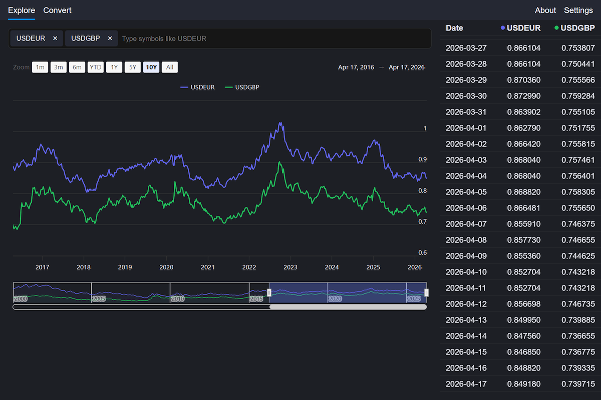

# Floats  [](https://floats-icmx.netlify.app/)


Currency analysis tool for exploring exchange rates, comparing multiple pairs, and viewing historical trends over time.

**[Check it here](https://floats-icmx.netlify.app/explore?by=USDEUR,GBPEUR)** — full-featured live demo, deployed on Netlify

[](./docs/assets/demo.png)

## About

This project was initially made as a tool for my own daily use.

There are lots of finance apps out there, but none of them fully supported my workflow (which previously lived in a Google Sheets setup). Floats replaces this setup with a simpler and more effective experience.

I specifically made this project as a tool, not a product. There are no extra distractions, flashy alerts, and other dark patterns.

### Features

- Support for 136 currencies (e.g., USD, EUR, CHF and more)
- Cross-rate calculation for any pair:
  - [USD/EUR](https://floats-icmx.netlify.app/explore?by=USDEUR), [NOK/JPY](https://floats-icmx.netlify.app/explore?by=NOKJPY), [AMD/UZS](https://floats-icmx.netlify.app/explore?by=AMDUZS), and more
  - 18k options available (136 × 135 = 18 360)
- Historical data for about 26 years, updated daily
- Multiple pairs support to compare on chart and table
- Shareable URLs
- Interactive chart for any time range
- Data table for precise values
  - Select & copy cells as in Excel
- Light/Dark theme with auto-detect
- Mobile-friendly with PWA support

## Technical Highlights

- URL-driven app state (selected currencies)
  - *Why:* enables deep linking, ability to share a view
- Dynamic cross-rate calculations for any pair (EUR pivot calculations)
  - *Why:* support for any currency pair, even without a direct rate
- Custom complex UI components:
  - Chip-based multiselect with autocomplete
  - Data table with virtual scrolling, cells range selection and clipboard integration
  - *Why custom:* this is intentional for learning depth ([described here](./docs/DECISIONS.md#why-own-implementation-for--))
- FOUC-free theme switching (no light theme flash on reload)

*See also: architecture [decisions](./docs/DECISIONS.md) and [specification](./docs/SPECS.md).*

## Built With

- [React](https://react.dev/) v19 + [React Router](https://reactrouter.com/) v7
- [Zustand](https://github.com/pmndrs/zustand) — state management
- [Highcharts](https://www.highcharts.com/) — chart
- [Vite](https://vite.dev/) — bundling
- [Vitest](https://vitest.dev/)
  - Currently only calculation, store, and main hooks tests, ~70-85% coverage
  - Planning to set up Vite Browser Mode to test critical components and pages

## Development

Clone repository:

```sh
git clone https://github.com/icmx/floats && cd floats
```

Install dependencies:

```sh
npm install
```

Run for development — navigate to [localhost:5173/explore?by=USDEUR](http://localhost:5173/explore?by=USDEUR):

```sh
npm run dev
```

Also supported:

```sh
npm run lint
npm run test
npm run build
```

## License

[MIT](LICENSE).
