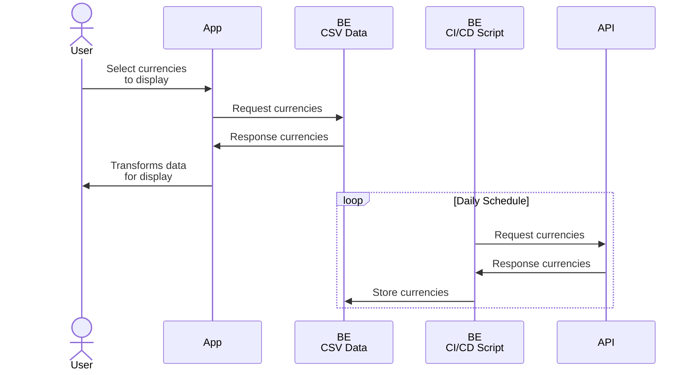

# Floats: Specs

> This document describes Floats' general data pipeline and interactions between the main project entities

## General Pipeline

Floats' data pipeline is currently built around two main entities:

- **App** — Frontend application built with React, the part visible to the end user
- **BE** — Static backend, a directory of CSV files updated daily by a CI/CD Node.js script

There are also two external entities:

- **User** — a person who uses Floats **App**
- **API** — Original exchange rates data source, a third-party API

Figure below describes their interactions at a high level:



## Backend Design

> [!NOTE]
> Current backend implementation is a **draft.** Although it works correctly, it's intentionally made minimal for now.

Static "backend" consists of two components described below:

- [**CI/CD Script**](#cicd-script) to fetch data from API
- [**CSV data**](#csv-data) storage

### CI/CD Script

Node.js script that saves original exchange rates to CSV files.

It's intentionally made dependency-free and in plain JavaScript. This approach allows to skip `install` and `build` stages completely, so overall script execution time takes just ~10-15 seconds, which is important when you're using a free or low-cost CI/CD tier.

The most significant tradeoff is the lack of solid typings (TypeScript) and any extra packages (like feature-rich API client instance). However, this is not a real issue for a simple single-task script.

### CSV Data

Exchange rates data stored in CSV files. Each currencies pair (e.g. EURCNY) is split into *historical* and *latest* rates, placed in separate files:

- Historical rates:
  - File: `/${BASE_URL}/EUR/${quote}.csv`
  - Updated by *appending:* new entries are appended to the end of the file
- Latest rate:
  - File: `/${BASE_URL}/EUR/${quote}.latest.csv`
  - Updated by *rewriting:* latest entry rewrites whole file content

Note that any pair always starts with Euro (code EUR): this is because Euro is considered as *pivot* currency. To get not EUR-based exchange rate (e.g. USDCNY), one has to perform *cross-rate* calculations for EURUSD and EURCNY pairs).

## General Contract

Main Floats data store is the list of CSV files that are compiled on a backend. Those files store exchange rates, two files per currencies pair:

- Historical rates:
  - File: `/${BASE_URL}/EUR/${quote}.csv`
  - Includes one or more entries, starting from the oldest available to one before latest entry (in practice it's yesterday rate)
- Latest rate:
  - File: `/${BASE_URL}/EUR/${quote}.latest.csv`
  - Includes only latest available entry (today rate)

### Structure

Both historical and latest rates CSV files have the same structure:

```csv
yyyy-mm-dd,rate-number
```

For instance:

```csv
2010-03-13,0.8628
2010-03-14,0.866
2010-03-15,0.85245
```

That is, each row describes a specific day (first column) and exchange rate (second column).

When a day is not available by some reason, its row will be missing.

### Rules

Both historical and latest rates CSV files have additional formatting rules that are intended to simplify and speed up parsing logic implementation.

All CSV files must follow these rules:

- Includes only two columns
- First column is calendar date in ISO 8601 YYYY-MM-DD format
- Second column is real decimal number (precision may vary)
- Columns are always separated by comma `,`
- Numeric values always use periods `.` to separate decimal part (if necessary)
- Never have heading rows (all rows are for data only)
- Never have quoted values (never use quotation characters)
- Never have whitespace characters within fields or values separators (except newline to separate entries)
- Never have empty lines or partial lines (row with empty date or rate column)
