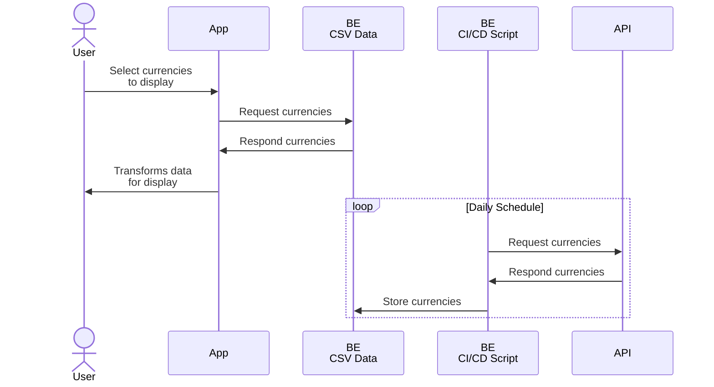

# Floats: Specs

> This document describes Floats' general data pipeline and interactions between the main project entities

## General Pipeline

Floats' data pipeline is currently built around two main entities:

- **App** — Frontend application built with React, the part visible to the end user
- **BE** — Static backend, a directory of CSV files updated daily by a CI/CD Node.js script

There are also two external entities:

- **User** — a person who uses Floats **App**
- **API** — Original exchange rates data source, a third-party API

Figure below describes their interactions at a high level:



## Backend Design

> [!NOTE]
> Current backend implementation is a **draft.** Although it works correctly, it's intentionally made minimal for now.

Static "backend" consists of two components described below:

- [**CI/CD Script**](#cicd-script) to fetch data from API
- [**CSV data**](#csv-data) storage

### CI/CD Script

Node.js script that saves original exchange rates to CSV files.

It's intentionally made dependency-free and in plain JavaScript. This approach allows to skip `install` and `build` stages completely, so overall script execution time takes just ~10-15 seconds, which is important when you're using a free or low-cost CI/CD tier.

The most significant tradeoff is the lack of solid typings (TypeScript) and any extra packages (like feature-rich API client instance). However, this is not a real issue for a simple single-task script.

### CSV Data

Exchange rates data stored in CSV files. Each currencies pair (e.g. EUR/CNY) is split into *historical* and *latest* rates, placed in separate files:

- Historical rates:
  - File: `/${BASE_URL}/EUR/${quote}.csv`
  - Updated by *appending:* new entries are appended to the end of the file
- Latest rate:
  - File: `/${BASE_URL}/EUR/${quote}.latest.csv`
  - Updated by *rewriting:* latest entry rewrites the entire file

Note that any pair always starts with Euro (code EUR): this is because Euro is considered as *pivot* currency. To get not EUR-based exchange rate (e.g. USDCNY), one has to perform *cross-rate* calculations for EUR/USD and EUR/CNY pairs.

## General Contract

Main Floats data store is the list of CSV files that are generated on a backend. Those files store exchange rates, two files per currencies pair:

- Historical rates:
  - File: `/${BASE_URL}/EUR/${quote}.csv`
  - Includes one or more entries, starting from the oldest available up to but not including the latest entry (in practice it's yesterday's rate)
- Latest rate:
  - File: `/${BASE_URL}/EUR/${quote}.latest.csv`
  - Includes only latest available entry (today's rate)

### Structure

Both historical and latest rates CSV files have the same structure:

```csv
yyyy-mm-dd,rate-number
```

For instance:

```csv
2010-03-13,0.8628
2010-03-14,0.866
2010-03-15,0.85245
```

That is, each row describes a specific day (first column) and exchange rate (second column).

When a day is not available for some reason, its row will be missing.

### Rules

Both historical and latest rates CSV files have additional formatting rules that are intended to simplify and speed up parsing logic implementation.

All CSV files must follow these rules:

- Includes only two columns
- First column is calendar date in ISO 8601 YYYY-MM-DD format
- Second column is floating-point decimal number (precision may vary)
- Columns are always separated by comma `,`
- Numeric values always use periods `.` to separate decimal part (if necessary)
- Never have heading rows (all rows are for data only)
- Never have quoted values (never use quotation characters)
- Never have whitespace characters within fields or values separators (except newline to separate entries)
- Never have empty lines or partial lines (row with empty date or rate column)

## Rates Fetching Pipeline

Due to static nature of exchange rates store, one has to perform an extra pipeline to fetch specific currencies pair rate. This process is described in sections below.

### 1. Data Loading

To perform data loading, target files must be defined first. Since available files are tied to pivot currency (Euro), this implies some extra logic.

#### 1.1. Generic example

1. Pair: USD/GBP (no EUR initially — most typical case)
2. Base: USD, quote: GBP
3. Available pivot rates: EUR/USD, EUR/GBP

That is, one has to load four following files:

- `/EUR/USD.csv`
- `/EUR/USD.latest.csv`
- `/EUR/GBP.csv`
- `/EUR/GBP.latest.csv`

After that, historical and latest rates must be joined into a single data array:

- `/EUR/USD.csv` + `/EUR/USD.latest.csv` => to single data array
- `/EUR/GBP.csv` + `/EUR/GBP.latest.csv` => to single data array

There are two edge cases where currencies pair initially includes EUR — first case is for base (EUR/xxx), and second is for quote (xxx/EUR).

#### 1.2. Pivot as a base example

1. Pair: EUR/JPY
2. Base: EUR, quote: JPY
3. Pivot rates: EUR/EUR, EUR/JPY

EUR/EUR pair makes no sense. This is "pivot as base" edge case, where EUR/JPY rate can be used directly without any extra calculations.

That is, only two files must be loaded:

- `/EUR/JPY.csv`
- `/EUR/JPY.latest.csv`

And then joined:

- `/EUR/JPY.csv` + `/EUR/JPY.latest.csv` => to single data array

After that, EUR/JPY currency is ready.

#### 1.3. Pivot as a quote example

1. Pair: JPY/EUR
2. Base: JPY, quote: EUR
3. Pivot rates: EUR/JPY, EUR/EUR

Again, EUR/EUR pair makes no sense, but for this case it's in quote place. As previously, this means that only two files must be loaded:

- `/EUR/JPY.csv`
- `/EUR/JPY.latest.csv`

And then joined:

- `/EUR/JPY.csv` + `/EUR/JPY.latest.csv` => to single data array

In contrast to previous case, this also assumes inversion calculation: all the rate values must be inverted by 1/x division (see below).

### 2. Data Alignment

Joined rates (historical and latest) must be aligned before calculations:

1. They must be sorted from oldest to most recent one
2. Missing days must be filled by previous available values

### 3. Data Calculation

This stage assumes that there are two aligned data arrays of exchange rates with pivot currency as base (EUR as a base, e.g. EUR/USD).

#### 3.1. Generic example

1. Pair: USD/GBP
2. Data arrays: EUR/USD, EUR/GBP

Once data arrays are aligned, all its items with the same days must be calculated. Consider this item for instance (CSV for readability):

```csv
      date, EURUSD, EURGBP
2010-01-01, 1.4287, 0.8895  <- this one is the single item
```

Now to get USD/GBP, one has to divide EUR/GBP by EUR/USD:

$$
\text{USD/GBP} = \frac{\text{quote}}{\text{base}}
               = \frac{\text{EUR/GBP}}{\text{EUR/USD}}
               = \frac{\text{0.8895}}{\text{1.4287}}
               ≈ 0.622594
$$

#### 3.2. Pivot as a base example

1. Pair: EUR/JPY
2. Data arrays: EUR/JPY (only one — same as source pair)

Once data array is aligned, it is ready to use. No extra calculations needed.

#### 3.3. Pivot as a quote example

1. Pair: JPY/EUR
2. Data arrays: EUR/JPY (only one — same as source pair, but inverted)

Once data array is aligned, it must be inverted, (take the reciprocal $\frac{1}{x}$). Consider this item:

```csv
      date, EURJPY
2010-01-01, 133.71  <- this one is the single item
```

Now EUR/JPY value must be inverted:

$$
\text{JPY/EUR} = \frac{\text{quote}}{\text{base}}
               = \frac{1}{\text{EUR/JPY}}
               = \frac{1}{133.71}
               ≈ 0.007479
$$
